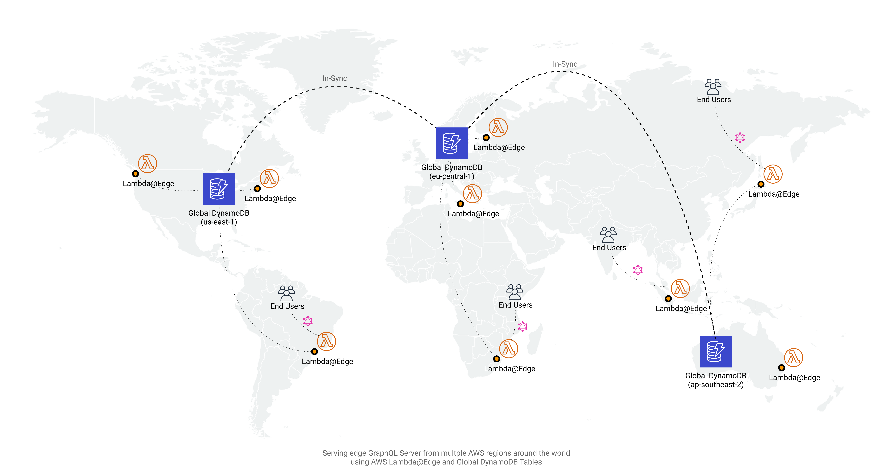

- [Demo Playground](https://d1pc7a0vu5q5b3.cloudfront.net/playground)

# Serverless GraphQL @ Edge + Global DynamoDB Tables

- Globally and highly available
- Apollo GraphQL Server at each of Edge locations using Lambda@Edge + CloudFront
- Globally replicated DynamoDB Tables
- GraphQL handlers routing to the closest DynamoDB table as persistence layer
- Pay-what-you-use model, no upfront or fixed charges, everything billed per-request
- Infra managed using AWS-CDK and Typescript
- Node functions packaged and minified automatically using Parcel

## Useful commands

 * `npm run build`   compile typescript to js
 * `npm run deploy`  deploy this stack to your default AWS account/region

## Limitations

- Your server must be rather lightweight. Minified GraphQL Server code must be less than 1 MB. Lambda@Edge is restricted to 128MB of memory and 5000ms of timeout for VIEWER_REQUEST integration type.
