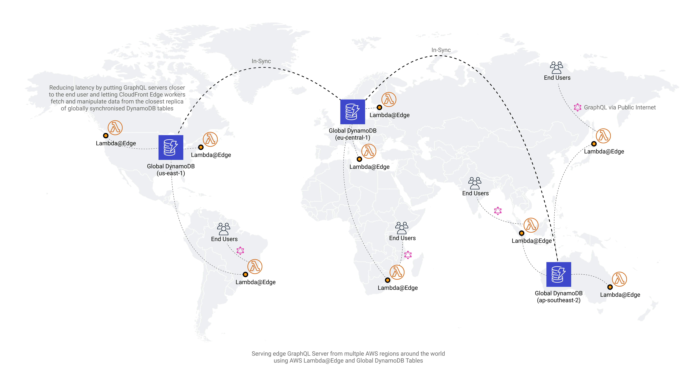

# Serverless GraphQL @ Edge + Global DynamoDB Tables

- GraphQL computed @ Edge (Cloudfront + Lambda@Edge)
- Globally replicated DynamoDB Tables
- GraphQL handlers routing to the closest DynamoDB table as persistence layer

## Useful commands

 * `npm run build`   compile typescript to js
 * `npm run watch`   watch for changes and compile
 * `npm run test`    perform the jest unit tests
 * `cdk deploy`      deploy this stack to your default AWS account/region
 * `cdk diff`        compare deployed stack with current state
 * `cdk synth`       emits the synthesized CloudFormation template

## Limitations

- Lambda@Edge is restricted to 128MB of memory and 5000ms of timeout for VIEWER_REQUEST integration type. Your server must be rather lightweight
